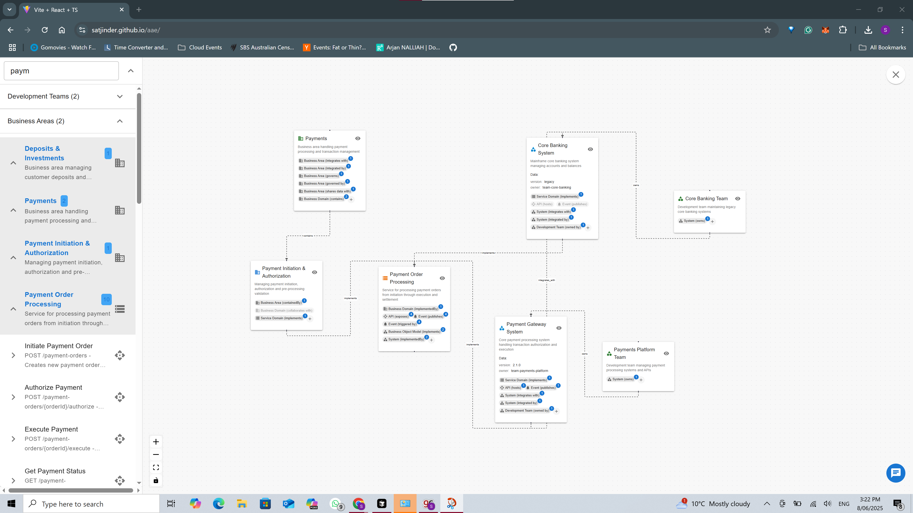

# Banking Industry Architecture Network (BIAN) Visualization Tool

## Overview
This project serves two primary objectives:
1. Exploration of AI capabilities in visualizing and understanding complex architectural patterns
2. Demonstration of BIAN (Banking Industry Architecture Network) concepts and their practical application in banking systems

The tool visualizes how BIAN's conceptual model maps to real-world banking systems and teams, effectively demonstrating Conway's Law in action. It provides an interactive way to understand the relationships between:
- BIAN service domains and capabilities
- Actual banking systems and applications
- Organizational team structures
- System interactions and dependencies

## Live Demo
The application is deployed and available at: [https://satjinder.github.io/aae/](https://satjinder.github.io/aae/)

## Key Features
- Interactive visualization of BIAN service domains
- Mapping of conceptual models to real systems
- Team structure visualization
- System dependency mapping
- AI-powered insights and analysis
- Client-side only application with BYOK (Bring Your Own Key) mode

## AI Integration
The application operates in BYOK (Bring Your Own Key) mode:
- Users can provide their own OpenAI API key
- The key is stored securely in the browser's local storage
- All AI operations are performed client-side
- No server-side storage or processing of API keys

## Technology Stack
- **Frontend Framework**: React 18 with TypeScript
- **UI Components**: Material-UI (MUI)
- **Visualization**: ReactFlow with ELK.js for graph layout
- **AI Integration**: LangChain with OpenAI
- **Build Tool**: Vite
- **Development**: TypeScript, ESLint
- **Deployment**: GitHub Pages

## Getting Started

### Prerequisites
- Node.js (Latest LTS version recommended)
- npm or yarn package manager
- OpenAI API key (for AI features)

### Installation
1. Clone the repository:
```bash
git clone [repository-url]
cd architecture-viewer
```

2. Install dependencies:
```bash
npm install
```

3. Start the development server:
```bash
npm run dev
```

The application will be available at `http://localhost:5173`

### Using AI Features
1. Visit the deployed application at [https://satjinder.github.io/aae/](https://satjinder.github.io/aae/)
2. Provide your OpenAI API key when prompted
3. The key will be stored in your browser's local storage
4. You can now use all AI-powered features of the application

## Project Structure
```
src/
├── components/     # React components
├── models/        # Data models and types
├── services/      # Business logic and API services
└── utils/         # Utility functions
```

## Diagrams

### Main Architecture Diagram
The interactive visualization board allows users to search and filter components using keywords. This enables quick navigation through the complex BIAN service domains and their relationships. Users can dynamically bring relevant items onto the board for detailed analysis.



### AI Agent Features
The AI-powered agent enhances the exploration experience by understanding natural language queries. It intelligently identifies relevant node types and relationships based on user input, making it easier to navigate the complex architecture.


The agent can provide deeper insights into the relationships between services and teams. When users ask about service ownership or team responsibilities, the agent understands the underlying connections and can reveal indirect relationships. For example, it can identify which teams are responsible for implementing specific service domains, even when these relationships aren't directly visible in the initial view.


## Contributing
Contributions are welcome! Please feel free to submit a Pull Request.

## License
[Add your license information here]

## Acknowledgments
- BIAN (Banking Industry Architecture Network) for their architectural framework
- The open-source community for the amazing tools and libraries used in this project
